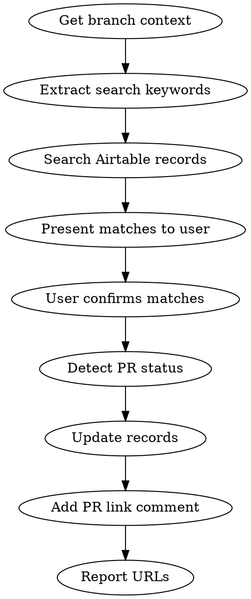

# Airtable Ticket Sync

Find Airtable tickets matching current branch work. Update state, assign owner, add PR link comments.

## When to trigger

- User invokes forge-pr skill (run this skill alongside it)
- User asks to update/sync Airtable tickets
- User asks "what Airtable tickets match this branch?"

## Airtable Constants

```
Base:       Product roadmap    (app28k8NqnFYDV9GY)
Table:      Features           (tblLpjVgfZL3mJvSs)

Fields:
  Ticket ID:  fldhgRd5K80aIvxTw  (formula)
  Title:      fld6xHHWjjxz8QECD  (singleLineText)
  Description:fld8J2OACjkyPSSZ8  (richText)
  State:      fldK4bvhlliaw70lo  (singleSelect)
  Owner:      fldmpQDTC9zALnfQP  (singleCollaborator)
  Type:       fldOhw1lA3pVHzZCm  (singleSelect)
  Priority:   fldH3lzVO2yeE10ya  (singleSelect)

State choices:
  seldWVx1tY2mPQBhC  "In Process"
  selexpgI1PT1e1q5J  "To Test"
  selcpbhBWgj2Sohx4  "Deployed/Complete"
  sel25bhVNTbBVlroy  "Pending"
  selNVZAetOwvgzAow  "Next"
  seljEvMX8rnnJWTAJ  "Deferred / Backlog"
  sels860asHtgSixku  "Verified"

Owner (Daniel Luna):
  User ID:    usra599HQ9UTw5M1j
  Email:      dluna@homeroom.com
```

## Flow



### 1. Get branch context

```bash
git log --oneline master..HEAD
git branch --show-current
```

### 2. Extract search keywords

From commit messages and branch name, extract 2-4 domain-relevant keywords. Examples:
- Branch `blackbaud-map-relationship-types` → search "blackbaud relationship", "relationship_type"
- Branch `fix-checkout-billing` → search "checkout billing", "billing"

Skip generic words (fix, add, update, refactor, spec, test). Focus on domain terms.

### 3. Search Airtable

Load tools first:
```
ToolSearch: select:mcp__airtable__search_records,mcp__airtable__list_records_for_table
```

Search with multiple keyword combinations in parallel:

```
mcp__airtable__search_records:
  baseId: app28k8NqnFYDV9GY
  table: tblLpjVgfZL3mJvSs
  query: <keywords>
  fields: ALL_SEARCHABLE_FIELDS
```

Deduplicate record IDs across all searches, then fetch details:

```
mcp__airtable__list_records_for_table:
  baseId: app28k8NqnFYDV9GY
  tableId: tblLpjVgfZL3mJvSs
  recordIds: [<all unique IDs>]
  fieldIds: ["fldhgRd5K80aIvxTw", "fld6xHHWjjxz8QECD", "fld8J2OACjkyPSSZ8", "fldK4bvhlliaw70lo", "fldOhw1lA3pVHzZCm", "fldH3lzVO2yeE10ya"]
```

### 4. Present matches

Show matching tickets in a table:

```markdown
| Ticket | Title | Type | State | Match reason |
|--------|-------|------|-------|--------------|
| [T1234] | ... | Bug | Pending | keyword: "relationship_type" |
```

Separate into **Direct matches** (clearly related to branch work) and **Related** (same domain area but different scope).

**Always ask user to confirm** which tickets to update. Never update without confirmation.

### 5. Detect PR status

```bash
gh pr view --json number,url,state,baseRefName 2>/dev/null
```

State mapping:
| PR state | Base branch | Airtable State |
|----------|-------------|----------------|
| OPEN | master/main | In Process |
| OPEN | develop | In Process |
| MERGED | master/main | Deployed/Complete |
| MERGED | develop | To Test |
| No PR found | — | In Process |

### 6. Update records

Load tools:
```
ToolSearch: select:mcp__airtable__update_records_for_table,mcp__airtable__create_record_comment
```

Update state and assign owner:

```
mcp__airtable__update_records_for_table:
  baseId: app28k8NqnFYDV9GY
  tableId: tblLpjVgfZL3mJvSs
  records: [{"id": "<record_id>", "fields": {"fldK4bvhlliaw70lo": "<state_name>", "fldmpQDTC9zALnfQP": {"id": "usra599HQ9UTw5M1j"}}}]
  fieldIds: ["fldhgRd5K80aIvxTw", "fldK4bvhlliaw70lo"]
```

### 7. Add PR link comment

For each updated record:

```
mcp__airtable__create_record_comment:
  baseId: app28k8NqnFYDV9GY
  tableId: tblLpjVgfZL3mJvSs
  recordId: <record_id>
  text: "<State>: <PR URL>"
```

Comment format examples:
- `"In progress: https://github.com/homeroom/api/pull/4379"`
- `"Fixed in https://github.com/homeroom/api/pull/4376"`
- `"In test: https://github.com/homeroom/api/pull/4380"`

### 8. Report results

Show summary table and Airtable record URLs:

```markdown
| Ticket | State | PR |
|--------|-------|----|
| [T1234] | Deployed/Complete | #4376 |

URLs:
- T1234: https://airtable.com/app28k8NqnFYDV9GY/tblLpjVgfZL3mJvSs/<record_id>
```

## Common mistakes

| Mistake | Fix |
|---------|-----|
| Searching for base by name ("homeroom", "issues") | Use hardcoded base ID `app28k8NqnFYDV9GY` directly |
| Loading MCP tools one at a time | Batch with `select:tool1,tool2,tool3` |
| Updating without user confirmation | Always present matches and ask first |
| Using generic keywords ("fix", "bug") | Extract domain-specific terms from commits |
| Setting state without checking PR target branch | `develop` target → "To Test", `master` target → state depends on merge status |
