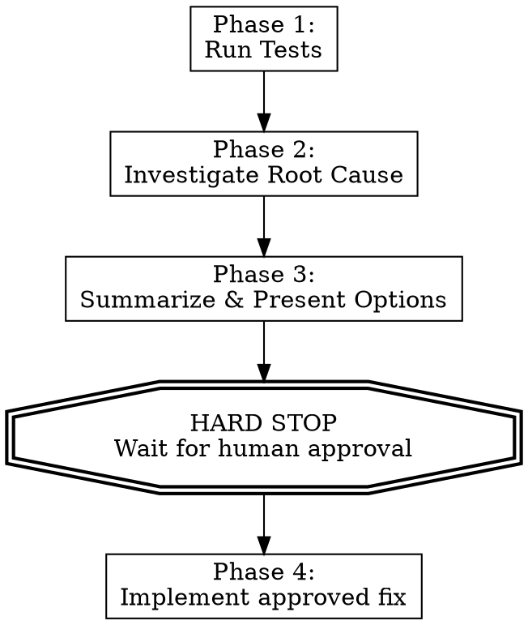

# Diagnose Test Failures

## Overview

Run tests, investigate root causes, summarize findings, present fix options. **Write ZERO code until the human approves a specific fix.**

**Core principle:** The human decides which fix to apply. Your job is diagnosis and options, not unilateral code changes.

## The Iron Law

```
NO CODE CHANGES WITHOUT EXPLICIT HUMAN APPROVAL
```

Not after investigation. Not after finding root cause. Not even for "obvious" fixes.
The human says "go ahead" or you don't touch code. Period.

## When to Use

- Test suite failing, user wants diagnosis
- User says "fix tests" or "why are tests failing"
- CI red, need to understand failures
- Flaky tests need investigation

## The Four Phases



### Phase 1: Run Tests

1. Run the test suite (or specific failing tests if user specified)
2. Capture full output — errors, stack traces, warnings
3. Count and categorize failures

**Do NOT skip to fixing.** Even if errors look obvious from output.

### Phase 2: Investigate Root Cause

For EACH failure:

1. **Read the failing test** — understand what it expects
2. **Read the implementation code** — understand what it does
3. **Trace the data flow** — where does expected diverge from actual?
4. **Check recent changes** — `git log`, `git diff` on relevant files
5. **Identify root cause** — not symptoms, the actual cause

**MANDATORY: You MUST read actual source files.** Do NOT guess at implementations from error messages alone. If you cannot access the source, tell the human and ask for the file path. Never present fix options based on speculation about what the code "probably" looks like.

**REQUIRED:** Use `superpowers:systematic-debugging` for complex failures.

**Do NOT propose fixes yet.** Investigation only.

### Phase 3: Summarize & Present Options

For EACH failure, present:

```
## Failure: [test name]

**What fails:** [one-line description]
**Root cause:** [what's actually wrong and why]
**Evidence:** [file:line, relevant code snippet]

### Fix Options:

1. **[Option A name]** — [description]
   - Pros: [why this is good]
   - Cons: [tradeoffs]
   - Risk: low/medium/high

2. **[Option B name]** — [description]
   - Pros: [why this is good]
   - Cons: [tradeoffs]
   - Risk: low/medium/high

**Recommended:** Option [X] because [reason]
```

Present ALL failures together so the human gets the full picture.

End with: **"Which fixes should I apply? Or would you like me to investigate any failure further?"**

### Phase 4: Implement Approved Fix (ONLY after approval)

1. Apply ONLY the fix(es) the human approved
2. Run tests again to verify
3. Report results

## Red Flags — STOP Immediately

If you catch yourself thinking:

- "This fix is obvious, just do it" → **STOP. Present options.**
- "Asking wastes a round trip" → **STOP. The round trip IS the point.**
- "It's just a typo" → **STOP. Even typos get presented as options.**
- "User said 'fix tests' so I should fix them" → **STOP. 'Fix' means 'diagnose and let me decide'.**
- "I already know the root cause, why wait?" → **STOP. Knowing the cause ≠ permission to code.**
- "Let me apply this and show them after" → **STOP. Approval BEFORE code, not after.**
- "I can tell from the error what the implementation looks like" → **STOP. Read the actual source file. Never guess.**

## Common Rationalizations

| Excuse | Reality |
|--------|---------|
| "Fix is obvious, asking wastes time" | Human may want different fix. May see context you don't. The round trip IS the value. |
| "User said 'fix it'" | "Fix" = diagnose + present options. User wants control, not autopilot. |
| "It's a one-character change" | Size doesn't determine need for approval. Process applies to ALL fixes. |
| "I already investigated thoroughly" | Investigation earns trust, not permission. Still need approval. |
| "Asking 'should I go ahead?' is annoying" | Being overridden after coding is MORE annoying. Ask first. |
| "Multiple failures, fixing obvious ones saves time" | Batch the summary. Present all options. Let human approve all at once. |
| "I can tell from the error what the code does" | Error messages show symptoms. Read the actual source. Guessing at implementation = wrong fixes. |

## Example Flow

**User:** "Tests are failing, fix them"

**You (Phase 1):** Run tests, capture output.

**You (Phase 2):** Read each failing test + implementation. Trace root causes.

**You (Phase 3):**
> ## Test Failure Summary
>
> ### 1. `User#full_name` returns double space
> **Root cause:** `full_name` concatenates first + last with space, but `middle_name` nil introduces extra space
> **Fix options:**
> 1. Use `[first, middle, last].compact_blank.join(" ")` — handles nil fields
> 2. Use `.squish` on result — simpler but masks data issues
> **Recommended:** Option 1, handles root cause cleanly
>
> ### 2. `Order#total` missing tax calculation
> **Root cause:** `total` method returns `subtotal` without tax
> **Fix options:**
> 1. Add `* (1 + tax_rate)` to total method
> 2. Create separate `total_with_tax` and update callers
> **Recommended:** Option 1 if `total` should always include tax
>
> **Which fixes should I apply?**

**User:** "Go with option 1 for both"

**You (Phase 4):** NOW write code. Run tests. Report.

## Integration with Other Skills

- **superpowers:systematic-debugging** — Use for Phase 2 investigation
- **superpowers:test-driven-development** — Use if fix requires new test cases
- **superpowers:verification-before-completion** — Use after Phase 4 to confirm fix
