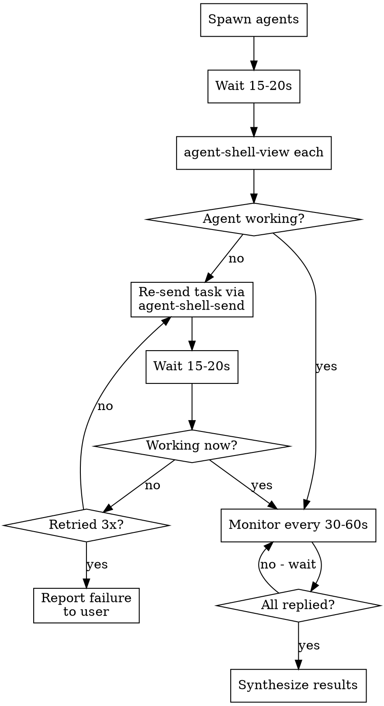

# Dispatching Emacs Sub-Agents

## Overview

Spawn tasks into separate Emacs agent-shell sessions using `agent-shell-spawn`, then monitor them to completion. Sub-agents sometimes fail to receive their initial prompt — you MUST verify and recover.

**Core principle:** Spawn, verify delivery, monitor progress, collect results. Never fire-and-forget.

## When to Use

- User says "execute with emacs sub-agents" or "use agent-shell"
- User wants tasks run in parallel Emacs Claude sessions
- Tasks are independent and benefit from separate agent contexts

**Don't use when:**
- Tasks share state or must run sequentially
- A single agent can handle the work faster
- User wants Claude Code subagents (use the Agent tool instead)

## The Pattern

### 1. Spawn with descriptive names and clear tasks

```bash
agent-shell-spawn "Nix Packages" "Read nix/home.nix and list all packages defined. Reply with your findings using: agent-shell-send \"$(agent-shell-whoami)\" \"your results\""
```

**Always include reply instructions** in the task so the sub-agent knows where to send results back.

### 2. Verify delivery (CRITICAL)

Wait 15-20 seconds after spawning, then check each agent:

```bash
agent-shell-view "Nix Packages Agent @ dotfiles" 30
```

**What to look for:**
- Agent is actively working (tool calls, output) → healthy
- `<shell-maker-failed-command>` or empty/stuck → prompt was NOT delivered
- Agent is idle with no output → prompt may not have arrived

### 3. Re-send on failure

If an agent didn't receive its prompt, re-deliver via `agent-shell-send`:

```bash
agent-shell-send "Nix Packages Agent @ dotfiles" "Read nix/home.nix and list all packages. Reply with findings using: agent-shell-send \"$(agent-shell-whoami)\" \"your results\""
```

Then verify again after 15-20 seconds.

### 4. Monitor periodically

Check agents every 30-60 seconds until all report back:

```bash
agent-shell-list          # see who's active
agent-shell-view "Name Agent @ project" 30  # check progress
```

### 5. Collect and synthesize

Once all agents reply (or you've confirmed completion via `agent-shell-view`), synthesize their results for the user.

## Quick Reference

| Step | Command | When |
|------|---------|------|
| Spawn | `agent-shell-spawn "Name" "task"` | Start |
| Verify | `agent-shell-view "Name Agent @ project" 30` | 15-20s after spawn |
| Re-send | `agent-shell-send "buffer" "task"` | If prompt not delivered |
| List | `agent-shell-list` | Check active agents |
| Monitor | `agent-shell-view "buffer" 30` | Every 30-60s |

## Common Mistakes

**Never fire-and-forget.** Spawning without verifying delivery is the #1 failure mode. Agents silently fail to receive prompts — you won't know unless you check.

**Never fall back to doing the work yourself.** If sub-agents fail, retry delivery. The user explicitly asked for emacs sub-agents. Doing the work yourself defeats the purpose. Retry at least 2-3 times before reporting the sub-agent approach isn't working.

**Never forget reply instructions.** Sub-agents don't automatically know where to send results. Always include `agent-shell-send "your-buffer" "results"` in the task.

**Buffer naming:** Agent buffers follow the pattern `Name Agent @ project`. Use `agent-shell-list` if unsure of exact names.

## Red Flags - STOP and Fix

- You spawned agents but didn't check on them → go back and verify
- You saw a failure and started doing the work yourself → re-send the task instead
- You checked once and assumed success → monitor until results arrive
- You spawned without reply instructions → re-send with instructions

## Monitoring Flowchart


